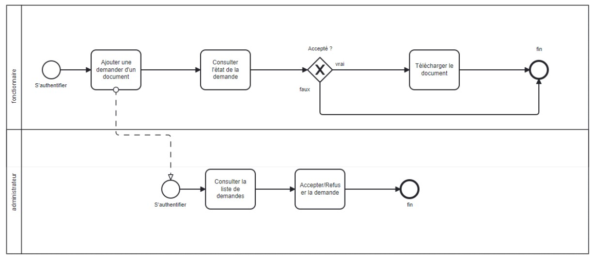
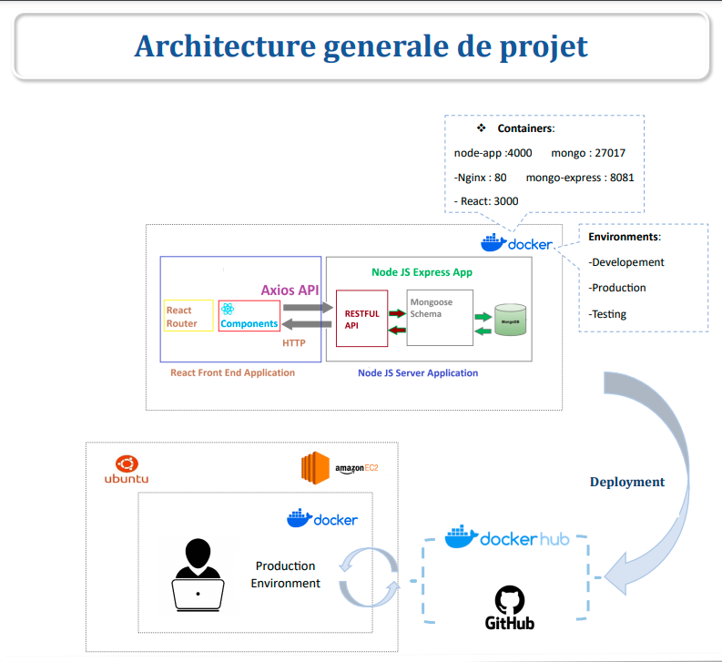

# ENSAJ GRH: Design and Implementation of a Human Resource Management System.

This project aims to maximize the efficiency of human capital management by leveraging a comprehensive set of features related to employee management, leave requests, certificates, and movements, whether they are professional or travel-related.

## Table of Contents

- [Overview](#overview)
- [Architecture](#architecture)
- [Prerequisites](#Prerequisites)
- [Deployment](#Deployment)
- [Containerization](#Containerization)
- [Contact](#contact)
- [Acknowledgments](#acknowledgments)

## Overview

The comprehensive Human Resources Management System (HRMS) presented here serves as a pivotal interface for efficiently handling employee related processes, including employee management, leave requests, attestations, and movements. One of its key features is the facilitation of advanced employee searches, enhancing the overall user experience. The main functionalities encapsulated within the system cover employee registration and authentication, employee management, advanced employee searches based on criteria such as name and department, leave management, attestation requests, and movement tracking. The primary users targeted by this system are the HR department and employees themselves.

The provided BPMN chart delineates the sequential steps involved in a scenario where a professor seeks certification. Commencing with the professor’s authentication into the system, the process unfolds as the professor submits a certification request, specifying the type and relevant details. Subsequently, the request undergoes scrutiny, with the secretary determining whether to approve or deny it. If approved, the professor is promptly notified and can retrieve the certified document through the system. Conversely, if the request is denied, the professor receives a notification with accompanying reasons, providing an opportunity for feedback and potential re-submission. This flowchart illustrates a coherent and efficient process for managing certification requests, promoting transparency and accessibility within the administrative workflow.

## Architecture

The provided figure showcases the robust and modern architecture adopted for a Human Resources Management project. The backend relies on Node.js and Express, seamlessly integrated with MongoDB through the Mongoose library for streamlined data interactions. The frontend is developed using React, ensuring a responsive user experience. Axios facilitates communication between frontend and backend. The application architecture is containerized, comprising five distinct containers: Nginx for HTTP requests, Node.js for the backend, MongoDB for the database, React for the frontend, and a dedicated container for the user interface. This containerization strategy optimizes application management and scalability, contributing to a streamlined deployment process. The application environment is structured into development, production, and testing segments, each serving a specific role in the development lifecycle. Docker Hub and GitHub are leveraged for code and container management. Tests are conducted on an Amazon EC2 Ubuntu instance with Docker installation, allowing comprehensive testing before full deployment in a production-like environment.


## Prerequisites

- Node.js et Express
- MongoDB
- Visual Studio Code
- Docker

## Deployment

The Human Resources Management (HRM) application is deployed and accessible online. You can access the application using the following link:

[Human Resource Management - Vercel Deployment](https://human-resource-management-frontend.vercel.app)

## Containerization

### Requirements

- [Docker](https://www.docker.com/products/docker-desktop) installed on your machine.


To deploy the Human Resources Management (HRM) application using Docker, follow these steps:

1. Make sure you have Docker installed on your machine.

2. Open a terminal and run the following command to pull the pre-built Docker image from the Docker Hub registry:

   ```bash
   docker pull ahmedlaaziz/grh_app

## Contact

For any queries or concerns, feel free to contact the project maintainers:

- [Laaziz Ahmed](mailto:laazizahmed72@gmail.com)
- [Mhani Mohamed Amine](mailto:aminemhani11@gmail.com)
- [Kadiri Youssef](mailto:youssefkadiri2001@gmail.com)
- [Kadiri Meriem](mailto:kadirimeriem133@gmail.com)

## Acknowledgments

We extend our sincere gratitude to our supervisor for his invaluable guidance, expertise, and unwavering support throughout this project. This journey has been both challenging and rewarding, and we couldn't have achieved this without your mentorship.
